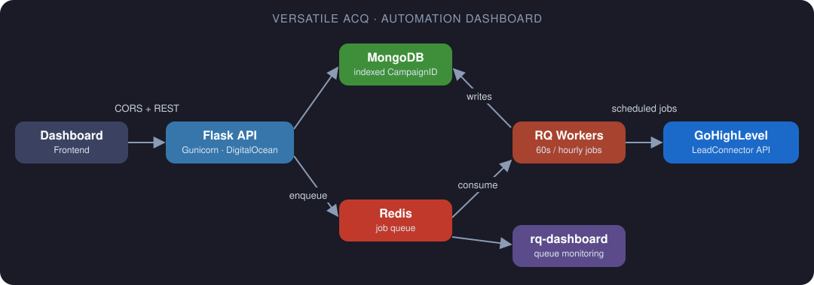

<!-- ===================== HEADER ===================== -->


<p align="center">
  <a href="https://github.com/Ayaz-Ahmad1">
    
  </a>
</p>

<p align="center">
  
  <a href="https://www.linkedin.com/in/Ayaz-Ahmad1/"></a>
  <a href="mailto:ezeecodes@gmail.com"></a>
  
</p>

---

## 🚀 About Me


I'm a **Python Backend Engineer** who builds the parts users never see but always rely on: REST APIs, integrations, background jobs, and the databases behind them.

- 🎓 **BS Computer Science (Hons.)**, Hazara University (2021)
- 💼 Building production Python backends professionally **since 2022**
- 🔌 Comfortable with **third-party API integrations** (GoHighLevel / LeadConnector and more)
- ⚙️ I like **automation**: scheduled workflows, queues and workers that keep running unattended
- 🧯 I've debugged production problems: **504 timeouts, CORS, Redis/RQ workers, DB datatype mismatches**
- 🌱 Currently leveling up in **FastAPI** and **GenAI-powered backends**
- 🏢 Co-building an **IT services agency** for international clients
- 💬 Ask me about **Django, Flask, REST APIs, background jobs and integrations**

<br clear="right"/>

```python
class AyazAhmad:
    role       = "Python Backend Engineer"
    location   = "Pakistan 🇵🇰"
    backend    = ["Django", "DRF", "Flask", "FastAPI"]
    databases  = ["PostgreSQL", "MySQL", "MongoDB"]
    async_work = ["Redis", "Celery", "RQ", "APScheduler"]
    deploy     = ["Linux", "Docker", "Gunicorn", "DigitalOcean"]
    learning   = ["FastAPI", "GenAI"]

    def motto(self):
        return "Clean APIs, reliable jobs, fewer 3 a.m. alerts."
```

---

## 🛠️ Tech Stack

<p align="center">
  <a href="https://skillicons.dev">
    
    <br/>
    
  </a>
</p>

<details open>
<summary><b>🐍 Backend & APIs</b></summary>
<br/>
<p>
  
  
  
  
  
  
  
</p>
</details>

<details open>
<summary><b>🗄️ Databases & Search</b></summary>
<br/>
<p>
  
  
  
  
</p>
</details>

<details open>
<summary><b>⚙️ Background Jobs & Automation</b></summary>
<br/>
<p>
  
  
  
  
  
</p>
</details>

<details open>
<summary><b>🔐 Security, Testing & Realtime</b></summary>
<br/>
<p>
  
  
  
  
  
  
</p>
</details>

<details open>
<summary><b>☁️ DevOps & Deployment</b></summary>
<br/>
<p>
  
  
  
  
  
  
</p>
</details>

---

## 💼 Experience

**🐍 Python Developer @ Webbuggs** &nbsp;·&nbsp; *Sep 2022 – Oct 2024*

- Built backend APIs with **Django, Django REST Framework and Flask** (modular services using Blueprints)
- Designed and managed **GoHighLevel / LeadConnector** API integrations for business data
- Integrated third-party platforms and synced external data into **PostgreSQL, MySQL and MongoDB**
- Ran automation and scheduled processing with **Redis, Celery, APScheduler** and background workers
- Handled **production deployment and troubleshooting** to keep APIs and backends reliable

**🌍 Freelance Backend Developer** &nbsp;·&nbsp; *Upwork & Toptal*

<p>
  
  
  
</p>

---

## 🏗️ Featured Projects

### ⚡ Versatile Acq — Automation Dashboard
A Flask backend that powers a campaign automation dashboard integrated with **GoHighLevel / LeadConnector**.

- Flask API + **MongoDB**, with indexed `CampaignID` lookups
- **Redis + RQ** workers running scheduled jobs (60s and hourly intervals), monitored with **rq-dashboard**
- Syncs locations, users, contacts and campaigns from external APIs
- Deployed on **DigitalOcean** behind **Gunicorn**, with frontend and backend hosted separately via CORS
- Fixed real production problems: **504 Gateway Timeouts, CORS errors, RQ worker "Broken pipe" failures**

<p align="center">
  
</p>

### 🔐 Secure File API — Flask
A Flask MVC application for secure file management.

- **PostgreSQL**, **Flask-JWT-Extended** (cookie-based access tokens), **Flask-WTF CSRF**, **bcrypt** hashing
- File upload, list, download and delete, plus a **token-based password reset** flow
- **pytest** suite with all tests passing

### 📋 HR Transformation & Evaluation System — Django
A **Django 4.2 / Python 3.10** platform for HR evaluation workflows.

- Role-based access for **Administrators, Companies and Consultants**
- Evaluation areas: *HR Strategy, Recruit, Retrain, Retain*, with draft, submit and finished states
- Weighted category/subcategory scoring (0–10), dynamic questions and **DRF** serializers

---

## 🤖 What I'm Building Next

Combining my backend, API and automation background with **GenAI**: finding problems that keep coming up in client work and turning them into reliable, reusable software.

---

## 📊 GitHub Stats

<p align="center">
  
  
</p>

<p align="center">
  
</p>

<p align="center">
  
</p>

<p align="center">
  
</p>

<!-- Snake animation: generated by .github/workflows/snake.yml -->
<picture>
  <source media="(prefers-color-scheme: dark)" srcset="https://raw.githubusercontent.com/Ayaz-Ahmad1/Ayaz-Ahmad1/output/github-snake-dark.svg" />
  
</picture>

---

## 🤝 Connect With Me

<p align="center">
  <a href="https://www.linkedin.com/in/Ayaz-Ahmad1/"></a>
  <a href="mailto:ezeecodes@gmail.com"></a>
  <a href="https://github.com/Ayaz-Ahmad1"></a>
</p>

<p align="center"><i>💡 Need a reliable Python backend, API integration or automation pipeline? Let's talk.</i></p>


